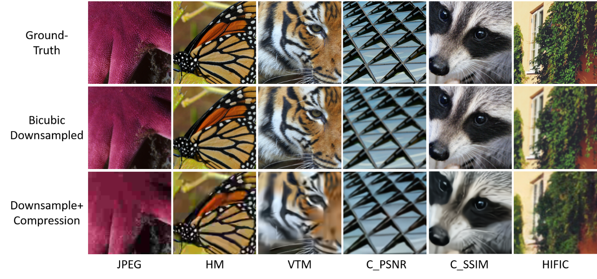

# source_code

# UCIP: A Universal Framework for Compressed Image Super-Resolution using Dynamic Prompt (ECCV2024)

[](https://arxiv.org/pdf/2407.13108)  [](https://lixinustc.github.io/UCIP.github.io/) [](https://drive.google.com/file/d/1LwZiTOofyhJTZb3yILSC9mCX1gsxTdrA/view) 

## :bookmark: News!!!
- [x] You can find the datasets from Google Drive [link](https://drive.google.com/file/d/1LwZiTOofyhJTZb3yILSC9mCX1gsxTdrA/view).
- [x] Full code has been released. You can train it or evaluate with our provided weights from Google Drive [link](https://drive.google.com/file/d/1X1632j5F8r0DZjzjurBA_gpliW7Aod8Z/view?usp=drive_link)

**Note: The project is finally open-sourced! Sorry it took so long, and the delay was about half a year, which was not as expected. Since I am not a student now, I got busy with work and honestly forgot about it for a while. I didn’t have the chance to maintain or clean up the code, but I still hope it proves useful to you.**

## 📌 Dataset for UCIP 
<p align="center">
  
</p>


## :sparkles: Getting Start

### Prepare environment

The CUDA driver must be higher than 11.6 

- Ubuntu 20.04
- CUDA 11.8
- Python 3.9
- PyTorch 2.1.1 + cu118

1: First install Pytorch (2.1.1+cu118) as following command:

```
pip install torch==2.1.1 torchvision==0.16.1 torchaudio==2.1.1 --index-url https://download.pytorch.org/whl/cu118
```
2: Install other requiremnets:
```
pip install -r requirements.txt
```

## Cite US
Please cite us if this work is helpful to you.

```
@inproceedings{li2024ucip,
  title={UCIP: A universal framework for compressed image super-resolution using dynamic prompt},
  author={Li, Xin and Li, Bingchen and Jin, Yeying and Lan, Cuiling and Zhu, Hanxin and Ren, Yulin and Chen, Zhibo},
  booktitle={European Conference on Computer Vision},
  pages={107--125},
  year={2024},
  organization={Springer}
}
```

## Acknowledgments
The basic code is partially from the below repos.
- [ActiveMLP](link)
